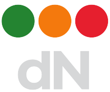

#  Kubernetes Monitoring Stack (K8s-m8g-stack)

An umbrella helm chart for Kubernetes Monitoring Stack deployment.

# Getting Started

K8s-m8g-stack umbrella helm chart is a collection of Kubernetes Monitoring charts:

* [k8s-m8g](https://git.ifne.eu/dnation/k8s-m8g)
* [kube-prometheus-stack](https://github.com/prometheus-community/helm-charts/tree/main/charts/kube-prometheus-stack)
* [loki-stack](https://github.com/grafana/loki/tree/master/production/helm/loki-stack)

### Installation

Prerequisites
* [Helm3](https://helm.sh/)

K8s-m8g-stack umbrella helm chart is currently hosted in the public [ifne](https://www.ifne.eu/) helm repository.
```bash
# Add ifne helm repository
helm repo add ifne https://nexus.ifne.eu/repository/ifne-helm-public/
helm repo update

# Install K8s-m8g
kubectl create namespace monitoring
helm install k8s-m8g-stack ifne/k8s-m8g-stack --namespace monitoring
```

# Contribution guidelines

If you want to contribute to the K8s-m8g-stack project, be sure to review the
[contribution guidelines](CONTRIBUTING.md). This project adheres to K8s-m8g-stack's
[code of conduct](CODE_OF_CONDUCT.md). When participating, you are required to abide by the code of conduct.

We use GitHub issues to manage requests and bugs, please visit our discussion forum if you have any questions.

# License

[Apache License 2.0](LICENSE)

# Project Background

K8s-m8g-stack project is developed, maintained and used in production by [dNation](https://www.dnation.tech/) professionals 
to simplify their day-to-day monitoring tasks.  
The development of K8s-m8g-stack was transformed to an open source project in October 2020.
