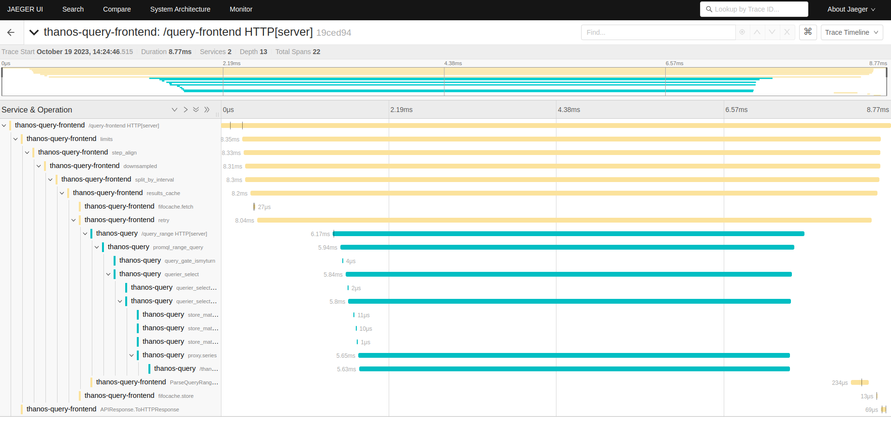

# Traces

This page contains a guide on how to enable traces in Thanos. Traces are not enabled by default.

Thanos supports different tracing backends that implements `opentracing.Tracer` interface.
All clients could be configured by `--tracing.config-file` parameter to reference to the configuration file or by `--tracing.config`
parameter to put yaml config directly. Recommended way is to pass configuration directly as it gives an explicit static view of
configuration for each component, and it also saves you the fuss of creating and managing additional files.

## Example

Here is the example of the configuration how to enable jaeger in Thanos. This configuration can be applied for multiple components e.g. query-frontend, query or thanos-sidecar.

```yaml
thanos:
  queryFrontend:
      extraFlags:
      - |-
        --tracing.config="config":
          "sampler_param": 2
          "sampler_type": "ratelimiting"
          "service_name": "thanos-query-frontend"
          "agent_host": "jaeger-agent.<namespace>.svc"
          "agent_port": 5775
        "type": "JAEGER"
```

## Usage

Once tracing is enabled, Thanos will generate traces for all gRPC and HTTP APIs thanks to generic “middlewares”.
Some more interesting to observe APIs like query or query_range have more low-level spans with focused metadata showing
latency for important functionalities. For example, Jaeger view of  query_range HTTP API call might look as follows:

